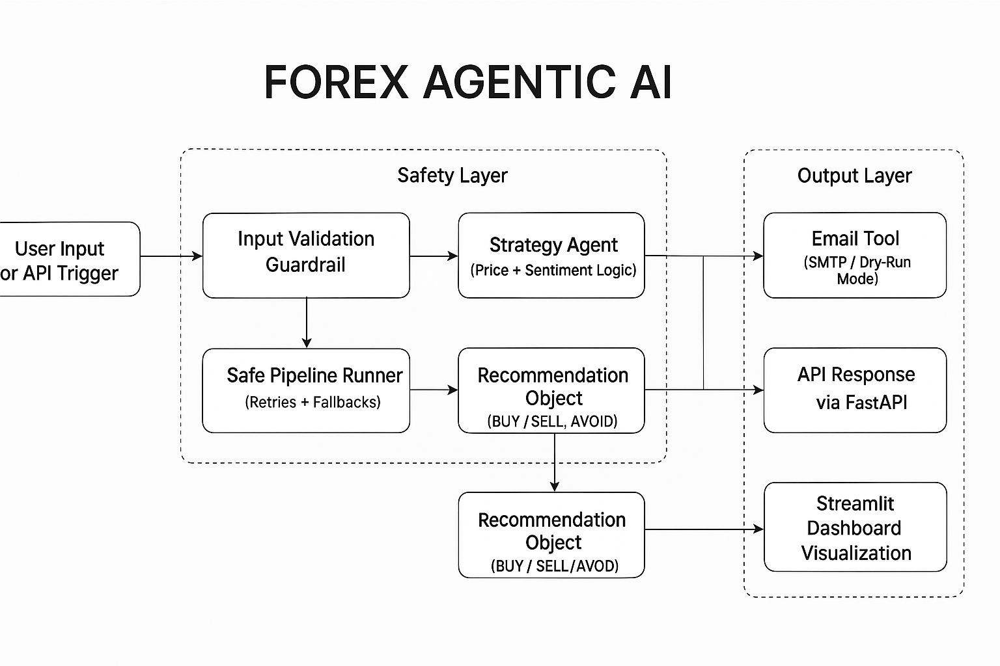

##  **Agentic Forex AI — Multi-Agent System with Cloud-Ready API and Dashboard**

**An end-to-end resilient Forex strategy assistant** built with Python, FastAPI, Streamlit, and agentic orchestration.  
It fetches live forex data, analyzes market sentiment via news feeds, and generates AI-driven trading recommendations.

### Tech Stack

| Layer                       | Technology                                                |
| --------------------------- | --------------------------------------------------------- |
| **Backend / Orchestration** | FastAPI, LangChain-style modular agents                   |
| **Frontend Dashboard**      | Streamlit                                                 |
| **Data Sources**            | Yahoo Finance (`yfinance`), FXStreet / Investing RSS      |
| **Validation & Guardrails** | Pydantic, Custom input & pipeline guardrails              |
| **Deployment**              | Docker + Supervisor (API + Dashboard in one container)    |
| **Resilience**              | Retry logic, fallbacks, safe defaults, structured tracing |
| **Observability**           | `/health` endpoint, logs, optional Sentry integration     |

---

## **Project Overview**

This system automates daily forex analysis by combining:

* **Quantitative signals** from real-time candle data  
* **Qualitative sentiment** from top financial news  
* **Agentic decision logic** that issues BUY / SELL / AVOID recommendations  
* **Email summaries** with rationale and news highlights  

It’s designed for **production reliability** — handling API timeouts, tool failures, and malformed data gracefully.

---

## **System Architecture**

```text
src/
├── agents/
│   └── strategy_agent.py       # AI logic: combines price + sentiment
├── tools/
│   ├── yfinance_tool.py        # Market data (Yahoo Finance)
│   ├── news_tool.py            # RSS news fetcher (FXStreet, Investing)
│   ├── email_tool.py           # Email sender / dry-run simulator
│   └── strategy_tools.py       # High-level integration logic
├── guardrails/
│   ├── input_validation.py     # Validates currency pairs
│   └── pipeline_safety.py      # Retries + fallback resilience
├── graph.py                    # Orchestrates pipeline per currency pair
├── schemas.py                  # Pydantic models (Candle, NewsItem, Recommendation)
├── main.py                     # CLI entrypoint for full batch runs
api.py                          # FastAPI endpoints
dashboard.py                    # Streamlit dashboard
supervisord.conf                # Runs API + Dashboard together
requirements.txt
Dockerfile
.dockerignore
.env.example
````



<details>
<summary>Show Mermaid Flow Diagram (Source)</summary>

```mermaid
flowchart LR
    A[User Input or API Trigger] --> B[Input Validation Guardrail]
    B --> C[Safe Pipeline Runner (Retries + Fallbacks)]
    C --> D[Market Data Tool (yfinance)]
    C --> E[News Tool (RSS: FXStreet, Investing, DailyFX)]
    D & E --> F[Strategy Agent (Price + Sentiment Logic)]
    F --> G[Recommendation Object (BUY / SELL / AVOID)]
    G --> H[Email Tool (SMTP / Dry-Run Mode)]
    G --> I[API Response via FastAPI]
    G --> J[Streamlit Dashboard Visualization]

    subgraph Safety Layer
        B
        C
    end

    subgraph Agents & Tools
        D
        E
        F
    end

    subgraph Output Layer
        H
        I
        J
    end
```

</details>

---

## **Running Locally**

### Setup Environment

```bash
python -m venv .venv
source .venv/bin/activate  # or .venv\Scripts\activate (Windows)
pip install -r requirements.txt
```

### Add Environment Variables

Create a `.env` file based on `.env.example`:

```bash
EMAIL_FROM=forexagent@yourmail.com
EMAIL_TO=you@example.com
EMAIL_DRYRUN=True
SMTP_HOST=smtp.gmail.com
SMTP_PORT=587
SMTP_USER=your_gmail
SMTP_PASS=your_app_password
```

---

### Run API Server

```bash
uvicorn api:app --reload --port 8000
```

Visit [http://localhost:8000/docs](http://localhost:8000/docs) for interactive API docs.

---

### Run Streamlit Dashboard

```bash
streamlit run dashboard.py
```

Displays:

* Currency dropdown
* Stance, confidence, rationale, and news highlights
* Backend health indicator

---

## **Guardrails & Resilience Features**

| Module                | Purpose                                      | Pattern                 |
| --------------------- | -------------------------------------------- | ----------------------- |
| `input_validation.py` | Validates currency pairs before pipeline run | Input Guardrail         |
| `pipeline_safety.py`  | Retries pipeline + fallback on failure       | Retry / Circuit Breaker |
| `schemas.py`          | Enforces structure for outputs               | Schema Validation       |
| `graph.py`            | Catches all exceptions & logs trace per run  | Graceful Degradation    |
| `news_tool.py`        | Retries malformed feeds with UTC fix         | Fault Tolerance         |
| `/health`             | Confirms uptime for Render / Railway         | Monitoring              |

The system automatically recovers from:

* API or network timeouts
* RSS feed failures
* Malformed or missing news data
* Empty or invalid model responses

Fallbacks ensure **users always get valid output** (usually an “AVOID” stance with rationale).

---

## **Deployment (Render Cloud)**

### Build & Deploy

1. Push your repo to GitHub
2. Create new **Render Web Service → Docker environment**
3. Set command:

   ```bash
   supervisord -c /app/supervisord.conf
   ```
4. Add environment variables in Render dashboard (same as `.env`)
5. Deploy

### Live URLs

* API: `https://forex-agentic-ai.onrender.com`
* Health: `https://forex-agentic-ai.onrender.com/health`
* Dashboard: `https://forex-agentic-ai.onrender.com:8501`

---

## **AAIDC-Aligned Resilience Implementation**

| AAIDC Concept                   | Implemented                               |
| ------------------------------- | ----------------------------------------- |
| Resilient Schema Validation     | ✅ via Pydantic                            |
| Retry & Timeout Strategy        | ✅ in pipeline_safety                      |
| Fallback & Graceful Degradation | ✅ via fallback recommendations            |
| State Recovery                  | ✅ trace-based replays                     |
| Resource Limits                 | ✅ bounded news & candle fetch             |
| Observability                   | ✅ `/health`, traces                       |
| Circuit Breakers                | ✅ light version via retry disable pattern |

---

## **Testing**

All guardrails tested under:

```bash
pytest tests/unit/test_guardrails.py -v
```

Outputs confirm validation, retry, and fallback logic correctness.

---

## **Example API Response**

**GET /run?pair=EURUSD**

```json
{
  "pair": "EURUSD",
  "stance": "BUY",
  "confidence": 0.80,
  "horizon_hours": 24,
  "rationale": [
    "Daily move +0.0007",
    "Positive sentiment reinforces BUY stance.",
    "This is not financial advice."
  ],
  "news": [
    {
      "title": "EUR/USD gains as USD weakens ahead of ECB speech",
      "source": "fxstreet.com",
      "url": "https://www.fxstreet.com/news/example-link"
    }
  ]
}
```

---

## **Maintainer Notes**

* All runs are logged under `/src/data/traces/` with timestamps.
* To extend:

  * Add new pairs in `.env → PAIRS`
  * Add new RSS sources in `news_tool.py`
  * Add analytics charts in Streamlit dashboard
* Safe defaults prevent crashes even under partial tool failure.

---

## Known Limitations

* Sentiment analysis accuracy depends on the quality and freshness of public RSS feeds (FXStreet, Investing.com, DailyFX).
* The system does **not predict market prices** — it provides stance recommendations (BUY / SELL / AVOID) based on qualitative signals.
* Network or feed downtime can lead to fallback “AVOID” stances.
* News bias or incomplete RSS coverage may affect sentiment balance.
* All outputs are **advisory only** — *not financial advice*.

---

## Maintenance & Lifecycle

* Monitor run logs under `/src/data/traces/` for pipeline health and error detection.
* Use the `/health` API endpoint for uptime checks (ideal for Render / Railway monitoring).
* Validate email sending periodically using `EMAIL_DRYRUN=False` in `.env`.
* Update RSS sources quarterly in `news_tool.py` for relevance and reliability.
* Add or remove supported pairs by updating `ALLOWED_PAIRS` in `input_validation.py` and `.env`.
* Rebuild and redeploy Docker image whenever dependencies or APIs are updated:

  ```bash
  docker build -t forex-agentic-ai .
  docker run -p 8000:8000 forex-agentic-ai
  ```
* Future enhancements:

  * Integrate Sentry or Prometheus for monitoring.
  * Add historical data dashboards via Streamlit.
  * Introduce caching for RSS feeds to reduce latency.

---

## Ethical & Compliance Notes

* All processed data is **publicly available**; no personal or sensitive data is stored or transmitted.
* The system adheres to **principles of transparency and explainability** — every output includes rationale and news sources.
* **No financial advice**: recommendations are algorithmic insights, not investment guidance.
* Built-in **guardrails** (validation + fallback + safe defaults) ensure graceful degradation under API/tool failures.
* Codebase follows **AAIDC Responsible Deployment Guidelines**:

  * Structured outputs validated via Pydantic schemas.
  * Retry, timeout, and circuit-breaker resilience layers.
  * Human-readable rationale for every automated decision.
  * Clear auditability via trace logs.

---

## **License**

MIT License © 2025 **Syeda Sarah Mashhood**

---

**Maintainer:**
Syeda Sarah Mashhood (2025)
For inquiries or contributions, open an issue or pull request on the project repository.

````


